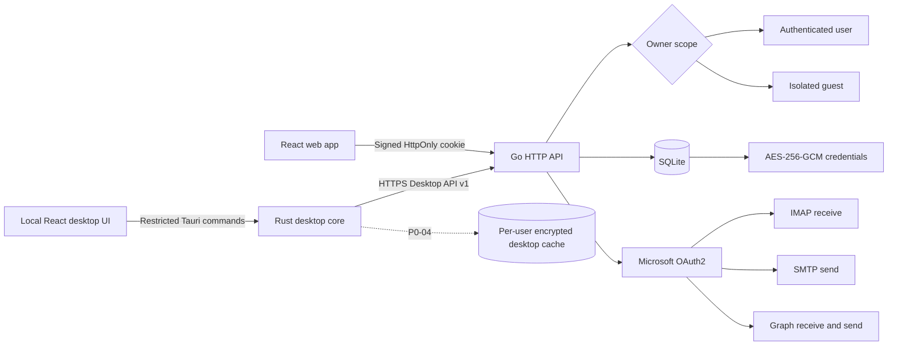

<p align="center">
  
</p>

<h1 align="center">Mail</h1>

<p align="center">
  A private, self-hosted workspace for managing Outlook, Hotmail, and Live mailboxes.
</p>

<p align="center">
  <a href="https://www.aillive.xyz/mail/"><strong>Live Demo</strong></a>
  ·
  <a href="README.zh-CN.md">简体中文</a>
  ·
  <a href="SECURITY.md">Security</a>
  ·
  <a href="CONTRIBUTING.md">Contributing</a>
</p>

<p align="center">
  <a href="https://github.com/amine123max/Mail/actions/workflows/ci.yml"></a>
  
  
  
  
  
</p>


Mail brings receiving, reading, organizing, and sending email into one responsive web application. It combines Microsoft OAuth2, IMAP, SMTP, Microsoft Graph, and an owner-scoped SQLite data layer without sending mailbox credentials to a third-party service.

The interface is designed for desktop and mobile use, supports English and Chinese, includes light and dark themes, and provides a dedicated administration workspace for users, activity, and announcements.

The production runtime is a single Go binary that serves both the API and the compiled React application. Node.js is used only to build the frontend; the former Express and TypeScript backend has been removed.

## Why Mail

| | Capability | What it provides |
| --- | --- | --- |
| ✉️ | Unified mailbox | Inbox, junk, sent mail, drafts, archive, trash, search, and message reading across multiple accounts. |
| 🔐 | Private by design | Passwords, Client IDs, and refresh tokens are encrypted with AES-256-GCM before SQLite persistence. |
| 🚀 | Hybrid OAuth2 transport | IMAP XOAUTH2 and Microsoft Graph receiving, plus SMTP OAuth2 and Graph sending with automatic fallback. |
| 👥 | Multi-user isolation | Every query is scoped to an authenticated user or an isolated guest session. |
| 🧭 | Complete account workflow | Batch import/export, grouping, ordering, testing, deletion, and Device Code authorization. |
| 📱 | Responsive interface | Purpose-built desktop and mobile layouts, resizable message panes, themes, and bilingual UI. |
| 🛡️ | Administration | First-run administrator setup, user overview, site activity, and announcement delivery. |
| 🍪 | Persistent guest mode | Receive-only guest sessions remain available through a signed HttpOnly browser cookie. |

## Product tour

All screenshots use fictional demonstration data. No production mailbox, token, or user information is included.

### Account management


### Focused compose workspace


### Microsoft authorization


### Administration


<table>
  <tr>
    <th>Secure sign in</th>
    <th>Verified registration</th>
  </tr>
  <tr>
    <td></td>
    <td></td>
  </tr>
  <tr>
    <th>System settings</th>
    <th>Mobile compose</th>
  </tr>
  <tr>
    <td></td>
    <td align="center"></td>
  </tr>
</table>

## Architecture



The desktop executable packages its React UI locally. Rust owns Windows integration and the restricted HTTPS client; the executable never connects directly to Microsoft OAuth, Graph, IMAP, or SMTP. The current production data store is the server-side SQLite database. The per-user desktop SQLite mail cache shown above is the P0-04 target and is not enabled yet.

### Mail transport

| Operation | Primary path | Fallback / behavior |
| --- | --- | --- |
| Receive | IMAP over TLS with XOAUTH2 | Microsoft Graph `Mail.ReadWrite` when IMAP is unavailable |
| Send | SMTP over STARTTLS with OAuth2 | Microsoft Graph `Mail.Send` when SMTP AUTH is unavailable |
| Refresh | Microsoft refresh token | Rotated tokens are encrypted and persisted immediately |
| Render HTML | Server-side sanitized content | Scripts, unsafe URLs, CSS network loads, private-network requests, and remote tracking resources are blocked |

### Privacy boundaries

- Account records use an `owner_key` such as `user:<id>` or `guest:<id>`.
- List, read, update, delete, sync, flag, move, and export operations always include the owner scope.
- Cookies contain only a signed session identifier—never a mailbox password, Client ID, or refresh token.
- Credentials are encrypted before being written to SQLite.
- Guest accounts can be migrated into the user's private namespace after sign-in or registration.
- Original email HTML is sanitized server-side; allowed remote images are fetched through an SSRF-protected proxy and converted to local data URLs.

## Quick start

### Requirements

- Go 1.26.5+
- Node.js 24+ and npm 11+ for building the React frontend
- Network access to Microsoft OAuth2, Outlook IMAP/SMTP, and Microsoft Graph

```bash
git clone https://github.com/amine123max/Mail.git
cd Mail
npm ci
cp .env.example .env
npm run dev
```

Open [http://localhost:5173](http://localhost:5173).

On a fresh database, Mail opens a one-time administrator setup screen. Enter a username, email, and password (at least 12 characters). Email verification codes are not required for this step; complete setup before exposing the instance on a public network. Configure the verification SMTP variables in `.env` before enabling registration or password reset. Signed-in users can create and delete API keys at `/api-keys`. The secret is shown only once and deleting a key takes effect immediately without any way to restore it. Script access uses `Authorization: Bearer mlk_...` against `/api/v1/keys/*` only; cookie and desktop session APIs do not accept API keys.

## Configuration

| Variable | Purpose | Production guidance |
| --- | --- | --- |
| `MAIL_SESSION_SECRET` | Signs login and guest cookies | Required; use at least 32 random characters |
| `MAIL_ENCRYPTION_KEY` | Encrypts stored mailbox credentials | Required; 32-byte Base64 or 64-character hex |
| `MAIL_DATA_DIR` | SQLite and local data directory | Mount a persistent, private directory |
| `MAIL_VERIFICATION_SMTP_HOST` | Verification email SMTP host | Required for registration and password reset |
| `MAIL_VERIFICATION_SMTP_PORT` | Verification SMTP port | Usually `587` or `465` |
| `MAIL_VERIFICATION_SMTP_SECURE` | Direct TLS mode | Use `1` for port `465`, otherwise `0` |
| `MAIL_VERIFICATION_SMTP_USER` | Verification SMTP username | Store as a deployment secret |
| `MAIL_VERIFICATION_SMTP_PASSWORD` | SMTP password / app password | Store as a deployment secret |
| `MAIL_VERIFICATION_FROM` | Verification sender identity | Required in production |
| `VITE_BASE_PATH` | Frontend deployment base | `/` or a subpath such as `/mail/` |
| `MAIL_COOKIE_PATH` | Session cookie scope | Match the deployment path, for example `/mail` |
| `HOST` / `PORT` | API bind address and port | Bind to loopback behind a reverse proxy |
| `MAIL_TRUST_PROXY` | Trust reverse-proxy headers | Set to `1` only behind a trusted proxy |

Generate an encryption key:

```bash
openssl rand -base64 32
```

## Import mailbox accounts

Import one mailbox per line. Mail accepts a real Tab separator or four hyphens:

```text
email<TAB>password<TAB>client_id<TAB>refresh_token
email----password----client_id----refresh_token
```

The password field is retained for compatibility with existing exports. Microsoft mail transport uses OAuth2 access tokens derived from the Client ID and refresh token.

## Microsoft authorization

The built-in Device Code flow requests the permissions required by the hybrid transport:

```text
https://outlook.office.com/IMAP.AccessAsUser.All
https://outlook.office.com/Mail.ReadWrite
https://outlook.office.com/SMTP.Send
https://graph.microsoft.com/Mail.ReadWrite
https://graph.microsoft.com/Mail.Send
offline_access
```

Mail never asks the user to enter a Microsoft password. The user completes authorization on Microsoft's verification page, and the resulting token is encrypted locally.

## Script API (`/api/v1/keys`)

API keys authenticate only this prefix with `Authorization: Bearer mlk_...`. Put script mailboxes in an account group (for example `register-pool`) first. Occupancy is stored as `(account, platform)`, not on the account row. `platform` is optional: omit it to occupy the mailbox for every platform. Success and release only need `leaseId`.

| Method | Path | Purpose |
| --- | --- | --- |
| `GET` | `/api/v1/keys/capabilities` | `{ "version": 1, "scopes": ["inbox.lease", "mail.read"] }` |
| `POST` | `/api/v1/keys/inboxes/lease` | Body `{ "group" }` with optional `platform`. Returns `leaseId`, `email`, `expiresAt` (30 minutes). `409` if the pool is empty |
| `GET` | `/api/v1/keys/inboxes/{leaseId}/messages` | Merged inbox + junk list: `id`, `from`, `subject`, `receivedAt`, `folder` (`inbox` or `junk`). IMAP junk ids are prefixed with `junk:` |
| `GET` | `/api/v1/keys/inboxes/{leaseId}/messages/{id}` | Inbox body: `text`, `html` |
| `POST` | `/api/v1/keys/inboxes/{leaseId}/success` | Keep the lock. A named platform lock stays per-platform; a lease without `platform` stays global |
| `POST` | `/api/v1/keys/inboxes/{leaseId}/release` | Optional `{ "reason" }`. Do not send `platform`; releasing a global lease makes the address available to every platform again |

A named lease occupies only that platform, so the same mailbox can still go to `trae` and `cursor`. Omitting `platform` occupies the mailbox globally. Success keeps the lock; release or TTL expiry clears that lease. Success and release do not take `platform`. Message reads merge Inbox and Junk, newest 100 first. A missing junk folder does not fail the inbox list.

The Accounts page lists the group and every active occupancy of each mailbox (a global occupancy shows as "All platforms"). Click the group tag to rename or clear the group, and the `×` on an occupancy tag to release it, which returns the mailbox to the pool immediately. That button calls `DELETE /api/accounts/{id}/occupancies` with an optional `?platform=` (omit it to release every occupancy of the account, `*` for the global one).

## Browser routes

Stable English paths support direct access, refresh, and browser history:

| Path | View |
| --- | --- |
| `/inbox` | Inbox |
| `/junk` | Junk |
| `/sent` | Sent mail |
| `/drafts` | Drafts |
| `/archive` | Archive |
| `/trash` | Trash |
| `/sendmails` | Compose workspace |
| `/accounts` | Account management |
| `/import` | Account import |
| `/oauth` | Sign-in and registration |
| `/microsoft-oauth` | Microsoft mailbox authorization |
| `/settings` | System settings |
| `/api-keys` | API keys |
| `/admin` | Administrator overview |

When deployed below `/mail`, the same routes become `/mail/oauth`, `/mail/inbox`, and `/mail/microsoft-oauth`. Signed-out visits to `/mail/` are redirected to `/mail/oauth`.

## Production deployment

```bash
npm ci
VITE_BASE_PATH=/mail/ npm run build
NODE_ENV=production MAIL_WEB_ROOT=./dist ./build/mail-server
```

For Docker:

```bash
docker compose up -d --build
```

For an Nginx subpath deployment, build with `VITE_BASE_PATH=/mail/`, set `MAIL_COOKIE_PATH=/mail`, and keep the trailing slash in:

```nginx
location = /mail {
  return 301 /mail/;
}

location /mail/ {
  proxy_pass http://127.0.0.1:3000/;
  proxy_set_header Host $host;
  proxy_set_header X-Forwarded-Proto $scheme;
  proxy_set_header X-Forwarded-For $proxy_add_x_forwarded_for;
}
```

Do not commit `.env`, SQLite files, master keys, backups, passwords, or mailbox tokens.

## Verification

```bash
npm test
npm run vet
npm run typecheck
npm run build
npm run audit
```

The regression suite covers Node-compatible password and encryption formats, legacy SQLite migration, account isolation and guest transfer, import/export, browser routes, SMTP and IMAP XOAUTH2 payloads, Graph request mapping, five-minute verification mail, safe MIME/HTML rendering, and SSRF boundaries.

## Project structure

```text
Mail/
├── server/              Complete Go backend
│   ├── cmd/mail/        Production server entry point
│   ├── cmd/bootstrap-admin/
│   ├── internal/        Auth, HTTP API, SQLite, crypto, IMAP, SMTP and Graph
│   ├── go.mod
│   └── go.sum
├── src/                 React application and responsive UI
├── public/              Brand assets and local fonts
├── docs/images/         Sanitized README screenshots
├── go.work              Go workspace pointing to server/
├── Dockerfile
├── docker-compose.yml
└── .env.example
```

## Security

Please read [SECURITY.md](SECURITY.md) before deploying publicly. Report security issues privately rather than opening a public issue containing credentials, tokens, logs, or mailbox content.

The Windows client trust boundaries, mitigations, and remaining release risks are documented in [docs/desktop-threat-model.md](docs/desktop-threat-model.md).

## License
Thanks to the [LINUX DO](https://linux.do/) open-source community for providing a platform for discussion and knowledge sharing.
